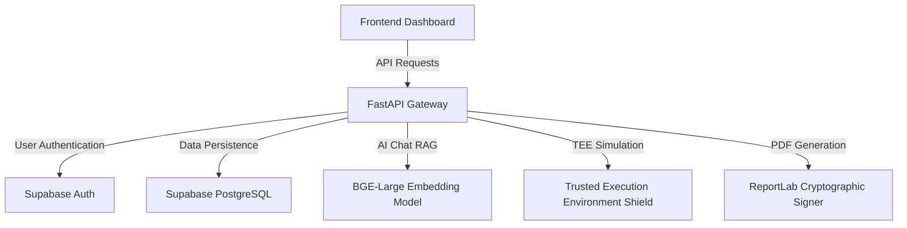

# FortTrace System Architecture & API Specifications Guide
**Comprehensive Technical Documentation for Presentation (PPT) Creators & Frontend Developers**

This document provides a highly detailed guide covering system architecture, backend data schemas, API specifications, and mathematical formulas utilized in the system.

---

## 1. System Architecture Overview



### Core Architecture Components:
1. **API Layer**: Developed in FastAPI (Python 3) providing endpoints for Asset Management, Diagnostics, Simulations, Cryptographic Reporting, and Expert Wisdom RAG.
2. **Database & Auth**: Supabase PostgreSQL featuring database check constraints, triggers, and Row Level Security (RLS) managed via Service-Role bypass API on backend.
3. **Vector Database**: PostgreSQL with `pgvector` extension utilizing the BGE-Large-EN-v1.5 embedding model (1024-dimensional dense vectors).
4. **Trusted Execution Environment (TEE) Shield**: A secure enclave simulation which anonymizes incoming natural language prompts (redacting sensitive IP, technician names, and plant areas) before passing them to LLMs.
5. **Digital Registry**: Merkle-like chain logging system tracking changes to Assets, Inspections, and Work Orders in `engineering_change_record`.

---

## 2. Feature 1: Expert Engineer Portal

### Purpose
Allows senior and retiring expert engineers to select active failure events, view associated alarms/work orders, and submit their tribal/tacit knowledge directly into the RAG system to preserve decades of plant experience.

### Technical Workflow
1. **Incident Loading**: Displays failure events with dynamic status determined by the presence of a `resolution_date` (NULL represents "Open", Not NULL represents "Resolved").
2. **Tacit Wisdom Submission**: Enters notes into `documents` table with `doc_type = 'LESSONS_LEARNED'`.
3. **Instant Vector Embedding**: Generates a 1024-dimension embedding using the `BGE-Large` model, inserting chunks into `document_embeddings`.
4. **Vector Search Query**:
   ```sql
   -- Retrieval is executed via custom match_embeddings RPC
   SELECT doc_id, chunk_text, 1 - (embedding <=> :query_embedding) AS similarity
   FROM document_embeddings
   WHERE 1 - (embedding <=> :query_embedding) > :match_threshold
   LIMIT :match_count;
   ```

### API Endpoints
* **List Failure Incidents**: `GET /api/v1/expert/failure-cases`
  * **Authorization**: Bearer JWT (Access Token)
  * **Allowed Roles**: `Expert_Engineer`, `Plant_Manager`, `Admin`
  * **Response Schema**:
    ```json
    {
      "total": 12,
      "cases": [
        {
          "failure_id": "uuid-string",
          "uat": "REF-HTX-R101-001",
          "asset_tag": "R-101",
          "asset_type": "reactor",
          "failure_mode": "high_temperature_trip",
          "failure_category": "mechanical",
          "severity": "critical",
          "occurrence_date": "2026-06-29",
          "status": "Resolved",
          "downtime_hours": 4.5,
          "financial_loss_inr": 750000.0,
          "expert_notes_count": 1
        }
      ]
    }
    ```

* **Incident Details**: `GET /api/v1/expert/failure-cases/{failure_id}`
  * **Response Schema**: Returns full diagnostics data (incident details, parent asset metadata, list of recent alarm events, related maintenance work orders, and existing wisdom notes).

* **Submit Wisdom**: `POST /api/v1/expert/wisdom`
  * **Request Payload**:
    ```json
    {
      "title": "Reactors seal cooling bypass strategy",
      "uat": "REF-HTX-R101-001",
      "insight_text": "Detailed insight about cooling loops and bearing housing...",
      "verdict": "Always inspect seal bypass valves during turnaround",
      "failure_id": "uuid-string-optional"
    }
    ```
  * **Response Schema**:
    ```json
    {
      "success": true,
      "doc_id": "newly-created-document-uuid",
      "message": "Expert wisdom successfully captured and embedded.",
      "embedding_dimensions": 1024
    }
    ```

---

## 3. Feature 2: Retired Experts Case Analysis Registry

### Purpose
Provides a view for **Plant Managers** and **Admins** to inspect plant reviews submitted by senior expert engineers. Displays active experts, their analysis count, and dossier cards.

### Two-Column UI Flow
1. **Left Column**: Interactive vertical list showing experts (`full_name`, `email`, `role`, and `reviews_count`).
2. **Right Column**: Scrollable dossier panel displaying reviews by the selected expert. Cards show the machine tag (`uat`), submission timestamp (`updated_at`), title, and full insight.
3. **Collapsible Insights**: Text blocks truncate to a maximum height of `80px` and expand/collapse via a "Read Full Analysis..." button.

```
+------------------------------------------+-------------------------------------------------------------+
| Active Experts                           | Dossier Reviews by Dr. Rajesh Kumar                         |
+------------------------------------------+-------------------------------------------------------------+
| Dr. Rajesh Kumar       [ 6 reviews ]     |  UAT: REF-HTX-R101-001             Submitted: 2026-07-21   |
| email: rajesh@forttrace.com              |  Title: Pump Bearing Seal Degradation                       |
|                                          |  [INSIGHT: Inspect casing seal loop flow regular...]        |
| Dr. Shivrao Patil      [ 2 reviews ]     |  [Read Full Analysis...]                                    |
| email: shivrao@forttrace.com             |                                                             |
+------------------------------------------+-------------------------------------------------------------+
```

### API Endpoint
* **Fetch Registry**: `GET /api/v1/expert/registry`
  * **Allowed Roles**: `Plant_Manager`, `Admin`
  * **Response Schema**:
    ```json
    {
      "experts": [
        {
          "expert_id": "uuid-string-or-system-default",
          "full_name": "Dr. Rajesh Kumar",
          "email": "rajesh@forttrace.com",
          "role": "Expert_Engineer",
          "reviews_count": 6,
          "reviews": [
            {
              "doc_id": "doc-uuid",
              "uat": "REF-HTX-R101-001",
              "title": "Pump Bearing Seal Degradation",
              "updated_at": "2026-07-21T18:12:00Z",
              "insight": "Expert Wisdom Note — Pump Bearing Seal Degradation...\nINSIGHT:..."
            }
          ]
        }
      ]
    }
    ```

---

## 4. Feature 3: What-If Emergency Cascade Stress Tester

### Purpose
Calculates the downstream "blast radius" and estimates financial exposure if an asset trips, determining immediate containment actions.

### Traverse & Math Specifications
1. **Adjacency Map construction**: Loads dependencies from the `asset_dependencies` table. If `flow_type` is NULL, it falls back to the `dependency_type` value to prevent failure.
2. **BFS Traversal**:
   - Starting from `source_uat`, performs standard Breadth-First Search.
   - Max recursion depth: **`4 hops`** to prevent cycles and runaway queries.
3. **Time to Impact Calculation**:
   - Sum of traversal time based on flow types along the path.
   - Default flow impact times:
     - `cooling_water` / `heat_removal`: **10 minutes per hop**
     - `power` / `electricity`: **5 minutes per hop**
     - `process_fluid` / `slurry`: **15 minutes per hop**
     - Fallback: **10 minutes per hop**
4. **Estimated Downtime Cost Formula**:
   $$\text{Hourly Exposure (USD)} = \sum_{i \in \text{Blast Radius}} (\text{Criticality Rating}_i) \times \$2,500$$
   $$\text{Daily Exposure (USD)} = \text{Hourly Exposure} \times 24$$
   *(Basis: $\$2,500\text{ per hour}$ for every criticality point across all affected downstream assets).*

### API Endpoint
* **Execute Simulation**: `POST /api/v1/simulation/cascade-trip`
  * **Request Payload**:
    ```json
    {
      "source_uat": "REF-HTX-R101-001",
      "trip_scenario": "fouling_shutdown"
    }
    ```
  * **Response Schema**:
    ```json
    {
      "source_uat": "REF-HTX-R101-001",
      "simulation_summary": {
        "severity_level": "CRITICAL",
        "severity_color": "#dc2626",
        "total_affected_assets": 5,
        "first_cascade_impact_minutes": 10
      },
      "financial_exposure": {
        "basis": "$2,500/hr per criticality point across 5 affected assets",
        "hourly_cost_usd": 62500.0,
        "daily_cost_usd": 1500000.0
      },
      "blast_radius": [
        {
          "uat": "REF-HTX-E201-001",
          "equipment_tag": "HX-306",
          "equipment_type": "heat_exchanger",
          "via_flow_type": "heat_removal",
          "estimated_minutes_to_trip": 10,
          "depth": 1
        }
      ],
      "immediate_actions": [
        "Isolate REF-HTX-R101-001 from upstream feed immediately",
        "Notify Plant_Manager of cascade risk: 5 assets at risk",
        "Check emergency shutdown SOP for heat_exchanger class"
      ]
    }
    ```

---

## 5. Feature 4: Cryptographic Compliance & signed Reports

### Purpose
Generates auditable PDF packages validating that maintenance events and ECRs (Engineering Change Records) conform to plant regulatory checklists.

### Merkle verification & signing logic
1. **Merkle Audit trail**: Fetches ECR commits from `engineering_change_record` (commits are cryptographically chained using `parent_hash` and `commit_hash`).
2. **SHA-256 Digital signature**:
   - The backend hashes the report parameters, plant metadata, latest commit hash, and timestamp:
     $$\text{Signature} = \text{SHA256}(\text{UAT} + \text{CommitHash} + \text{Timestamp} + \text{SecretKey})$$
   - Returned to the client in the custom **`X-Digital-Signature`** response header.

### API Endpoints
* **PDF Report Generator**: `GET /api/v1/reports/compliance-package?uat={uat}`
  * **Output**: Binary stream (`application/pdf`)
  * **Headers Returned**:
    * `X-Digital-Signature`: `sha256-hash-value-for-verification`
    * `Content-Disposition`: `attachment; filename=compliance_package_UAT.pdf`

---

## 6. AI Chat & TEE Anonymization Shield

### Trusted Execution Environment (TEE) Anonymization
When the "TEE Shield" is enabled, prompt data is processed in a simulated secure hardware enclave (AMD SEV-SNP/Intel SGX) to protect corporate intellectual property:
1. **Redaction**: Replaces sensitive data patterns:
   - Plant location tags (e.g., `"MUM-PLANT-01"` → `"[PLANT_REDACTED_0]"`)
   - Operator and technician names (e.g., `"Vikas Nair"` → `"[OPERATOR_REDACTED_0]"`)
   - Equipment specific IDs.
2. **LLM Query**: Redacted text is sent to the LLM.
3. **De-anonymization**: The LLM's response is mapped back to the original entities inside the enclave before being returned to the user.

---

## 7. Slide Deck Outline (PPT)
Developers or business analysts presenting FortTrace can structure their slides as follows:

| Slide # | Slide Title | Key Content / Bullet Points |
|---|---|---|
| **1** | Title Slide | **FortTrace Operations Dashboard**<br>Digital Twin, RAG, & Compliance Portal |
| **2** | The Problem | Unstructured tribal knowledge loss from retiring senior engineers.<br>Untracked cascade failures.<br>Audit trail vulnerabilities. |
| **3** | RAG Expert Portal | **Feature 1 & 2**<br>Real-time knowledge capture and indexing.<br>1024-dimensional BGE vector embeddings.<br>Retired Expert Registry dossier tracker. |
| **4** | What-If Simulator | **Feature 3**<br>BFS dependency blast-radius evaluation (up to 4 hops).<br>Downtime cost models ($2,500/hr/criticality point). |
| **5** | Security & Compliance | **Feature 4**<br>Merkle-chain ECR tracking.<br>SHA-256 PDF signatures.<br>TEE (AMD SEV-SNP) prompt anonymizer. |
| **6** | Tech Stack Summary | FastAPI + Supabase PostgreSQL + ReportLab + Llama-3.3. |
